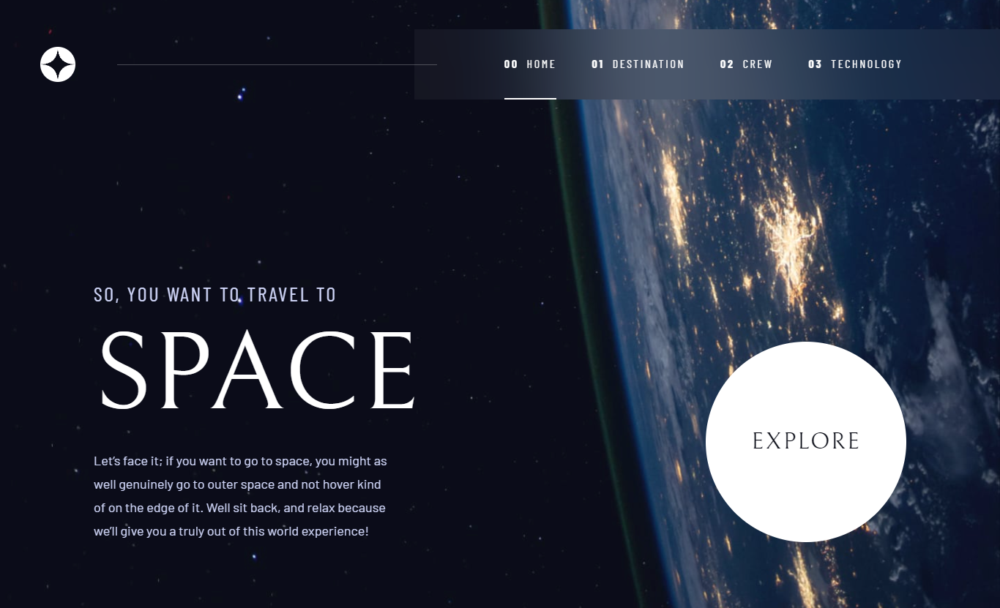

# Space tourism website

<!-- screenshots here -->

A challenge from [frontendmentor.io](https://www.frontendmentor.io/)

## Overview

### Links

- [Live Site](https://space-tourism-boedegoat.vercel.app/)
- [Solution](https://www.frontendmentor.io/solutions/space-tourism-app-with-nextjs-tailwind-css-phx1gIWDx)

### The challenge

Users should be able to:

- View the optimal layout for the site depending on their device's screen size
- See hover states for all interactive elements on the page
- Create the background shape using code

## My process

### Built with

- Semantic HTML5 markup
- Flexbox
- Mobile-first workflow
- Tailwind CSS
- Next.js

### What I learned

This project is quite challenging. I got some difficulties to make the responsive layout between mobile, tablet, and desktop. Aside from that, I learnt a lot especially for building unique layout even though it's not perfect.

### Useful Resources

1. [Figma](https://www.figma.com/) - Paste your project design mockups to check the size, colors, etc.

## Acknowledgments

Thank you very much to everyone who gave me feedback on my solution. It greatly assists me in improving my frontend development skills.
